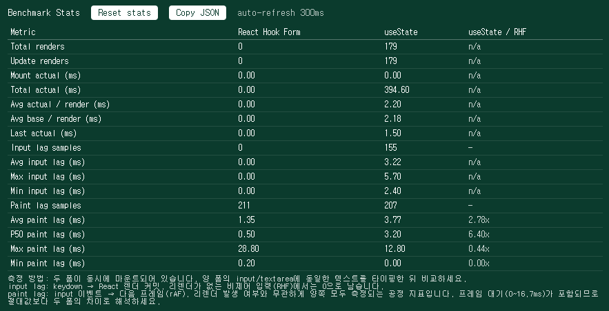
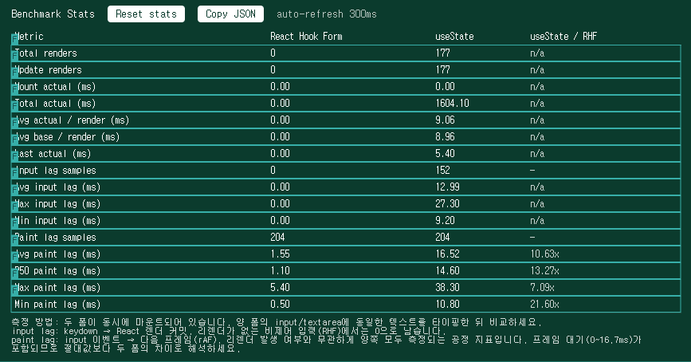

# 폼 상태 관리 방식 비교: React Hook Form vs useState

> 체험 등록 폼(`MyActivitiesCreate`)의 상태 관리 방식을 정하기 위해, 동일한 폼을
> 제어 컴포넌트(`useState`) / 비제어 컴포넌트(`React Hook Form`) 두 가지로 구현하고
> 키 입력당 리렌더링 비용을 직접 측정해 비교한 기록.

- 측정일: 2026-06-05
- 측정자: 이수지
- 관련 브랜치: `experiment/form-benchmark`

---

## 1. 문제 인식

`useState`로 폼의 각 필드를 관리하면 입력이 일어날 때마다 폼 컴포넌트 전체가
리렌더링된다. 비제어 컴포넌트 기반인 React Hook Form은 입력값을 ref로 관리하므로
키 입력 시 리렌더링이 발생하지 않는다.

이 차이가 **현재 폼 규모에서 실제로 체감될 만한 비용인지**, 그리고
**폼이 커지거나 저사양 기기에서 어떻게 확대되는지**를 수치로 확인하기 위해 측정했다.

## 2. 측정 환경

| 항목         | 값                                                                           |
| ------------ | ---------------------------------------------------------------------------- |
| 기기 / CPU   | ASUS ROG Strix G713QC / AMD Ryzen 7 5800H (8코어 16스레드, 기본 3.2GHz)      |
| 브라우저     | Chrome (DevTools Performance → CPU throttling 사용)                          |
| 빌드 모드    | **production** (`next build --profile --webpack` → `next start`)             |
| CPU 스로틀링 | 케이스 A: 없음(1x) / 케이스 B: 4x slowdown                                   |
| 측정 폼      | `MyActivitiesCreate` (제목·설명 텍스트 필드에 동일 문장 반복 입력, 약 200타) |

> ⚠️ 일반 `next build`(프로덕션)에서는 React `<Profiler>`의 `onRender`가 호출되지 않아
> 렌더링 지표가 모두 0으로 나온다. production에서 Profiler를 동작시키려면 `--profile`
> 플래그(= `react-dom/profiling`)로 빌드해야 한다.
>
> CPU 스로틀링은 DevTools Performance 탭의 **CPU** 드롭다운(`4x slowdown`)으로 적용했다.
> (네트워크 스로틀링 `Fast 4G` 등은 CPU 작업에 영향이 없으므로 주의.) 적용 여부는
> Console에서 `console.time` 루프로 1x 대비 약 4배 느려지는지 검증했다.

## 3. 측정 방법

- 측정 도구: React `<Profiler>`의 `actualDuration`(리렌더링 실제 소요 시간) +
  자체 측정한 input lag / paint lag
- 측정 페이지: `/benchmark` — 동일한 폼을 RHF / useState 버전으로 **동시 마운트**해
  같은 조건에서 비교한다. (`src/app/benchmark/page.tsx`)
- 절차:
  1. `Remount both forms (hard reset)`로 통계 초기화
  2. 양쪽 폼의 **제목·설명** 필드에 같은 문자열을 같은 길이로 타이핑
  3. 상단 StatsPanel 수치를 기록 (`Copy JSON`으로 raw 데이터 확보)
  4. CPU 스로틀링 유(4x)/무(1x) 각각 측정 (1x는 여러 차례 반복해 안정성 확인)

핵심 지표:

- `updateRenderCount`: 키 입력으로 발생한 리렌더링 횟수
- `avgActualDuration`: 리렌더링 1회당 평균 소요 시간(ms)
- `avgInputLag`: keydown → React 커밋까지 지연 — 리렌더링이 없는 RHF에서는 표본이 쌓이지 않음
- `p50PaintLag`: input 이벤트 → 다음 프레임 지연의 중앙값 — 리렌더링 유무와 무관하게 양쪽 모두
  측정되는 공정 지표 (avg는 이상치에 흔들려 중앙값으로 해석)

## 4. 측정 결과

> 아래 표는 캡처(`screenshots/`)와 동일한 측정값이다. 각 폼에 동일 문장을 약 200타 입력했다
> (useState는 입력당 리렌더링, RHF는 리렌더링 0회).

### 케이스 A — CPU 스로틀링 없음 (1x)

| 지표                     | React Hook Form     | useState | useState / RHF |
| ------------------------ | ------------------- | -------- | -------------- |
| Update renders           | 0                   | 179      | —              |
| Avg actual / render (ms) | 0 (호출 없음)       | **2.20** | —              |
| Avg input lag (ms)       | n/a (리렌더링 없음) | **3.22** | —              |
| P50 paint lag (ms)       | **0.5**             | **3.2**  | 약 6.4배       |

> 1x는 여러 차례 측정해도 일관(리렌더링 1.7~2.2ms, input lag 2.7~3.2ms, paint p50 2.7~3.4ms).

### 케이스 B — CPU 4x slowdown

| 지표                     | React Hook Form     | useState  | useState / RHF |
| ------------------------ | ------------------- | --------- | -------------- |
| Update renders           | 0                   | 177       | —              |
| Avg actual / render (ms) | 0 (호출 없음)       | **9.06**  | —              |
| Avg input lag (ms)       | n/a (리렌더링 없음) | **12.99** | —              |
| P50 paint lag (ms)       | **1.1**             | **14.6**  | 약 13.3배      |

### 1x → 4x 변화 (useState)

| 지표                     | 1x   | 4x    | 배수         |
| ------------------------ | ---- | ----- | ------------ |
| Avg actual / render (ms) | 2.20 | 9.06  | **약 4.1배** |
| Avg input lag (ms)       | 3.22 | 12.99 | 약 4.0배     |
| P50 paint lag (ms)       | 3.2  | 14.6  | 약 4.6배     |

> RHF는 1x→4x에서도 리렌더링 0회 유지, paint lag만 0.5 → 1.1ms로 소폭 증가.
> 할 일(리렌더링)이 없으므로 CPU가 느려져도 비용이 거의 확대되지 않는다.

### 스크린샷

#### StatsPanel — 1x (스로틀링 없음)



#### StatsPanel — 4x slowdown



## 5. 원인 분석

- **useState (제어 컴포넌트)**: 키 입력 → `setState` → 폼 컴포넌트 리렌더링 → Virtual DOM diff → 커밋.
  키 입력 1회당 `actualDuration`(1x 2.20ms)만큼의 비용이 항상 발생한다.
- **React Hook Form (비제어 컴포넌트)**: 입력값을 ref로 관리하므로 키 입력 시 리렌더링이
  발생하지 않는다 → `updateRenderCount`가 0이고 `inputLag` 표본이 쌓이지 않는다.

리렌더링 비용은 **CPU가 느릴수록 배수로 확대**된다. CPU 4배 스로틀링 시 useState의 1회당
리렌더링 비용이 2.20ms → 9.06ms로 약 4.1배, 입력 지연도 3.22ms → 12.99ms로 약 4.0배 커졌다.
반면 RHF는 리렌더링 자체가 없어 CPU 속도와 거의 무관하게 일정하다.

4x 환경에서 useState의 paint 지연 중앙값 14.6ms는 60fps 프레임 예산(16.7ms)에 육박해,
저사양 기기에서는 한 프레임을 통째로 놓치는 수준의 입력 버벅임이 체감되기 시작한다.

## 6. 결론

- 현재 폼 규모 + 일반 데스크톱 환경(케이스 A)에서는 두 방식의 체감 차이가 작다
  (useState 1회당 약 2.2ms, paint 지연도 두 방식 모두 한 자릿수 ms).
- 그러나 제어 컴포넌트는 키 입력당 약 2.2ms의 리렌더링 비용을 **구조적으로** 발생시키며,
  이 비용은 필드 수에 비례하고 저사양 기기(케이스 B)에서 약 4배로 확대된다.
- 따라서 향후 폼 확장과 저사양 기기 사용자를 고려해 **React Hook Form을 채택**한다.
  (유효성 검증·`register` 연동·보일러플레이트 감소의 DX 이점도 함께 고려.)

---

### 재현 방법

```bash
git checkout experiment/form-benchmark
pnpm exec next build --profile --webpack   # production + React 프로파일링
pnpm exec next start
# 브라우저에서 /benchmark 접속
# (4x 측정 시) DevTools → Performance → CPU: 4x slowdown
```
